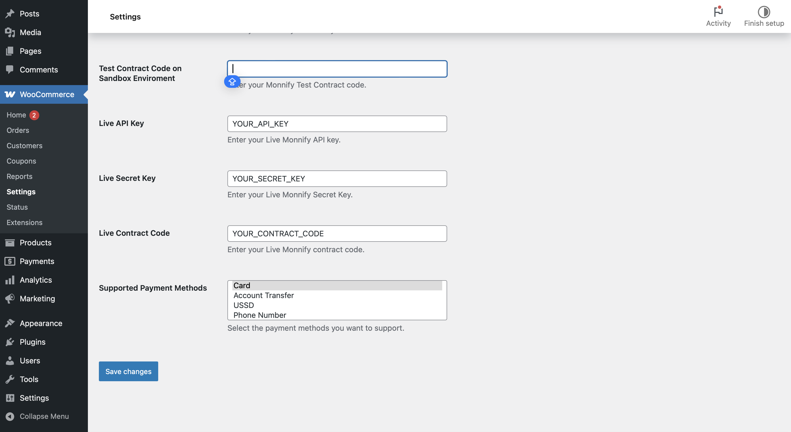
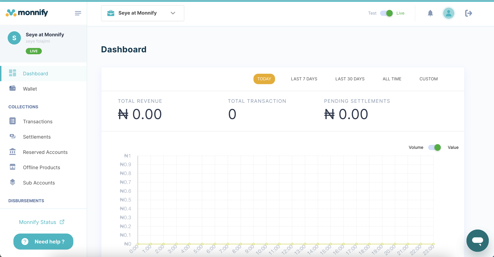
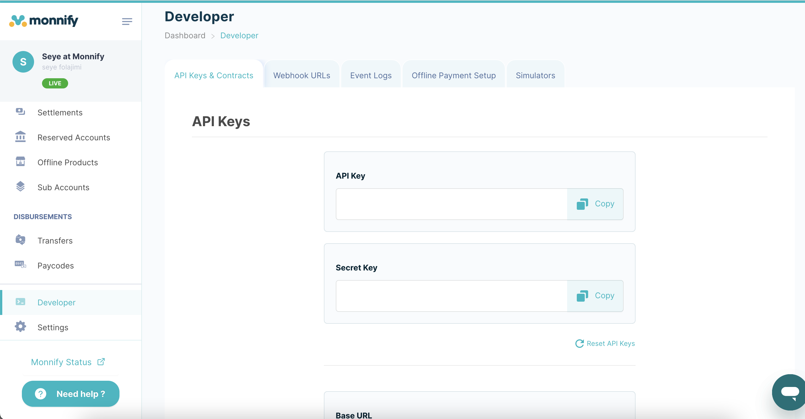

# Monnify Official Payment Gateway

**Contributors:** jimiejosh, marvelous-benji, oresho
**Tags:** payment gateway, monnify, e-commerce, woocommerce, nigeria, africa, card, bank transfer 
**Requires at least:** 5.6
**Tested up to:** 6.8
**Stable tag:** 1.0.1
**Requires PHP:** 7.4
**License:** GPLv2 or later  
**License URI:** [GNU General Public License, version 2](https://www.gnu.org/licenses/gpl-2.0.html)
Monnify Official Payment Gateway plugin provides a seamless payment experience for your customers on your WordPress website. 

## Description

Monnify Official Payment Gateway Plugin enables seamless integration of Monnify, a reliable and secure payment gateway, into your WordPress e-commerce website. With Monnify, you can accept payments from various payment methods and provide your customers with a smooth and secure checkout experience.

**Key features include:**
- Easy setup and configuration.
- Support for multiple payment methods, including card payments and bank transfers.
- Real-time transaction monitoring and reporting.
- Enhanced security features to protect your customers' data.
- Seamless integration with popular e-commerce plugins.
- Supports WooCommerce block checkout

Whether you're running a small online store or a large e-commerce platform, Monnify Official Payment Gateway Plugin is the ideal solution for accepting payments and managing transactions with ease.

## Frequently Asked Questions

**Q: How do I install and configure the Monnify Official Payment Gateway Plugin?**

1. Install the plugin via the WordPress plugin installer.
2. Activate the plugin through the 'Plugins' menu
3. Navigate to the plugin settings.
4. Select 'Enable Test Mode' if you would like to make test payments.
5. Enter your Monnify API credentials
6. Select the payment methods you would like to support, Hold "SHIFT" to select multiple (Works only in Live Mode).

For detailed instructions, please refer to monnify documentation, https://developers.monnify.com/docs/integration-tools/plugin-libraries

**Q: What payment methods does Monnify support?**

Monnify supports a wide range of payment methods, including credit/debit card payments, USSD, Pay with Phone,Bank transfers etc. You can configure the payment methods you want to offer to your customers in the plugin settings.

## Screenshots

1. Plugin settings screen
   

2. Dashboard with real-time transaction monitoring.
   

3. Configuration settings for Monnify payment gateway.
   

## Changelog

### 1.0.1
- Added webhook enhancement to allow asynchronous order confirmation in case of network failure

### 1.0.0

- Initial release of the Monnify Official Payment Gateway Plugin.
- Supports WooCommerce block checkout.

## Upgrade Notice

### 1.0.0

Upgrade to version 1.0.0 to start accepting payments through Monnify using the WooCommerce block checkout and enhance the payment experience for your customers.

---